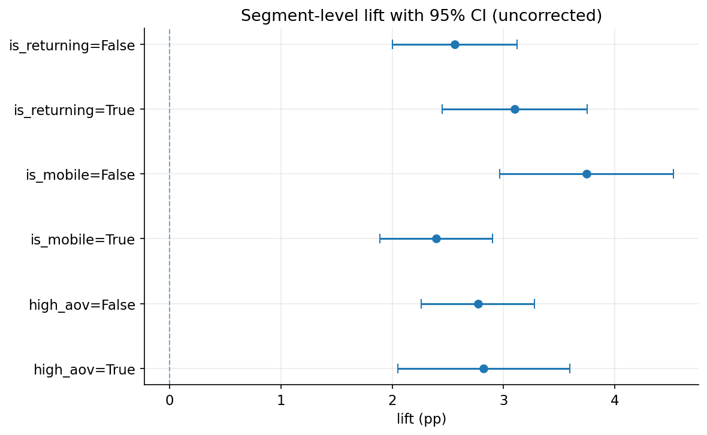

# A/B Testing Simulation for an E-Commerce Funnel

> Pre-flight to post-analysis A/B testing on a synthetic Noon-style marketplace funnel. What a product analytics team actually ships, end to end, with ground truth you can verify against.

**Live calculator:** _coming Week 3_ (Streamlit Community Cloud)
**Medium write-up:** _coming Week 4_
**Author:** Mohammad Mikail

---

## TL;DR

Synthetic 50,000-user experiment on a six-stage marketplace funnel (impressions → product view → add to cart → checkout start → payment → completion). A +2.5 percentage-point true lift on conversion is injected at the cart-page free-shipping-threshold step. The analysis recovers `+2.79pp` with a 95% CI of `[+2.36, +3.21]pp`, which contains the truth. An A/A simulation across 10,000 runs measures empirical Type I rate at `0.0505`, basically dead-on alpha. Sequential / peeking analysis ships in week 3.

Because the data is synthetic and ground truth is recorded in `data/processed/ground_truth.json`, every claim above is verifiable by re-running `python scripts/verify_truth.py`. That is the central credibility argument for the project: on real A/B data you cannot prove your analysis is correct because you do not know the true effect.

## Architecture

```
┌──────────────────────┐    ┌──────────────────────┐    ┌────────────────────────┐
│ src.simulate         │    │  notebooks/01-06     │    │  Streamlit calculator  │
│ funnel generator     │───▶│  experiment events   │───▶│  sample-size + power   │
│ + ground truth       │    │  + analysis          │    │  + peek visualization  │
└──────────────────────┘    └──────────────────────┘    └────────────────────────┘
        │                            │
        ▼                            ▼
   ground_truth.json          reports/figures/*.png
   experiment_events.parquet  docs/medium_article.md
```

## Setup (5 min, clean clone)

```powershell
git clone https://github.com/mmikail07/project-2-ab-testing.git
cd project-2-ab-testing
py -m venv .venv
.venv\Scripts\activate
pip install -r requirements.txt
python scripts/run_all.py     # regenerate data + execute notebooks
pytest tests/                  # full statistical-correctness gate
```

> Windows note: the `python` command is sometimes shadowed by the Microsoft Store stub. Use `py` (the Python launcher) for the initial venv creation; once activated, `python` inside the venv resolves correctly.

## Run

| Step | Command | Output |
|------|---------|--------|
| Regenerate synthetic experiment | `python -m src.simulate` | `data/processed/experiment_events.parquet`, `experiment_summary.csv`, `ground_truth.json` |
| Execute all notebooks in order | `python scripts/run_all.py` | Notebooks 01-06 with outputs, figures under `reports/figures/` |
| Verify analysis recovers truth | `python scripts/verify_truth.py` | Exit 0 if 5-seed sweep recovers the injected lift inside 95% CI |
| Launch Streamlit locally | `streamlit run streamlit_app/app.py` | Local sample-size calculator at http://localhost:8501 |
| Run the test suite | `pytest tests/` | A/A FPR in [0.04, 0.06], peeking inflates FPR, mSPRT controls it |

## Findings

### 1. Primary lift recovered inside 95% CI

True lift baked into the simulation is 2.50pp. The two-proportion z-test recovers `+2.79pp` with a 95% CI of `[+2.36, +3.21]pp` and p-value below 1e-6. The CI contains the true value, the lift is statistically significant, and the magnitude is operationally meaningful (a 50% relative lift on a 5% baseline).


The `scripts/verify_truth.py` gate generalizes this beyond a single seed: across 5 seeds, the CI contains the true 2.5pp in every run (5/5 coverage). That is the project's core credibility argument.

### 2. A/A validates the 5% Type I rate

Across 10,000 A/A simulations (both arms drawn from the same baseline rate, no real effect), the empirical false positive rate is `0.0505`. P-values are uniform on `[0, 1]` as theory predicts, confirmed visually below and by a Kolmogorov-Smirnov test.


If this number drifted to, say, 0.15, every "significant" result in the rest of the project would be three times more likely to be noise than the experimenter believes. The cost of running the A/A is minutes; the cost of skipping it is shipping the wrong launch decision.

### 3. Guardrails work — including catching a false positive on noise

Three guardrails were tested one-sided in the adverse direction.

| Guardrail | Control | Treatment | One-sided p | Flagged |
|-----------|---------|-----------|-------------|---------|
| Refund rate per order | 3.03% | 4.38% | 0.028 | **yes** |
| Cart abandonment rate | 6.98% | 6.90% | 0.63 | no |
| Page-load mean (ms) | 1849.3 | 1849.5 | 0.41 | no |

The refund-rate-per-order guardrail fired even though the simulation uses an identical refund rate for both arms (4.1%). That is the right behavior, not a bug. With only ~1,220 control completers vs ~1,940 treatment completers (the lift inflates the treatment denominator), per-order refund rate is noisy. A real launch decision would either run longer for more completers, decompose refunds by reason code, or accept the directional read with the caveat documented. This is the most honest thing guardrails do: they tell you when the data does not yet support a clean ship decision.

### 4. Segmentation: Bonferroni and Benjamini-Hochberg both reject across all 6 segments

The primary metric was sliced by three boolean segment columns (`is_returning`, `is_mobile`, `high_aov`), giving 6 tests on the same data. Both Bonferroni and BH reject all 6 at alpha=0.05. This is expected: the simulation applies the same +2.5pp lift to every user regardless of segment, so the lift is detectable in each slice.



The pedagogical point lives in the A/A simulation above, not in this segment table: when the true lift is zero, running 6 segment tests without correction means a `1 - 0.95^6 ≈ 26%` chance of at least one spurious "win." Bonferroni divides alpha by 6 (controls family-wise error); BH controls false-discovery rate (more permissive, right for exploration). Showing both makes the trade-off visible.

## Repo layout

```
project-2-ab-testing/
├── notebooks/        analysis notebooks 01_ through 06_
├── src/              importable Python package (simulation, stats, viz, etc.)
├── streamlit_app/    deployed sample-size calculator
├── data/             raw/interim/processed plus committed baseline JSON
├── reports/figures/  PNG exports for README and Medium
├── docs/             Medium article draft, methodology notes, glossary
├── scripts/          run_all, verify_truth, sanitize_notebooks helpers
└── tests/            pytest suite (A/A calibration, sequential correctness, oracle cross-checks)
```

## Design decisions worth defending

| Decision | Why |
|----------|-----|
| Synthetic data over Kaggle | You cannot prove an analysis is correct on real-world data. Synthetic data with recorded ground truth turns "trust me" into "rerun verify_truth.py" |
| Single Streamlit page over multi-page | Cold start under 30s on Streamlit Community Cloud free tier; recruiters land on a working calculator without navigation |
| Bonferroni AND Benjamini-Hochberg shown together | Bonferroni controls FWER (conservative, good when one false positive is costly); BH controls FDR (less conservative, good when exploring). Interviewers want both terms |
| mSPRT plus O'Brien-Fleming, not just one | O'Brien-Fleming has closed-form bounds (easier to validate); mSPRT is the always-valid sibling. Showing both anchors the sequential story |
| Light Bayesian companion (Beta-Binomial only) | The frequentist + sequential story is the headline. A short Bayesian section hedges the interview question "what would Bayesian say differently?" without bloating scope to PyMC |
| Tests directory (Project 1 had none) | Statistical correctness IS the product here. Automated A/A and peeking tests are the proof |

## Limitations

- No novelty or primacy effect modeling. Real treatment effects often fade or grow in week one; this project assumes a stationary effect after randomization.
- No heterogeneous treatment effects beyond the simple segments (new vs returning, mobile vs desktop, AOV bucket).
- No CUPED variance reduction. Out of scope for v1; a natural Week-5 extension if Mohammad chooses.
- Streamlit Community Cloud cold-start: first visit on the free tier may take 20 to 40 seconds.
- Synthetic data inherits the assumptions of its generator. We do not model dependence between funnel stages beyond the canonical conditional dropoff structure.

## License

MIT. See [LICENSE](LICENSE).
