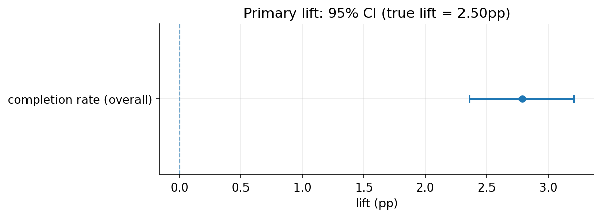
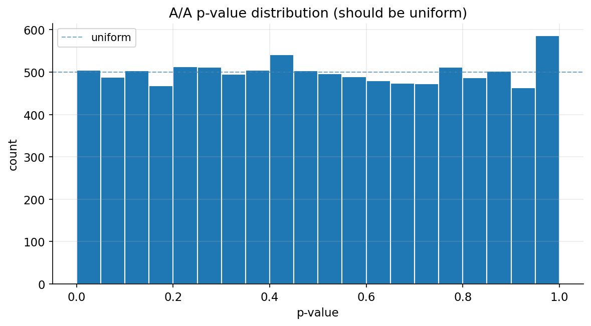
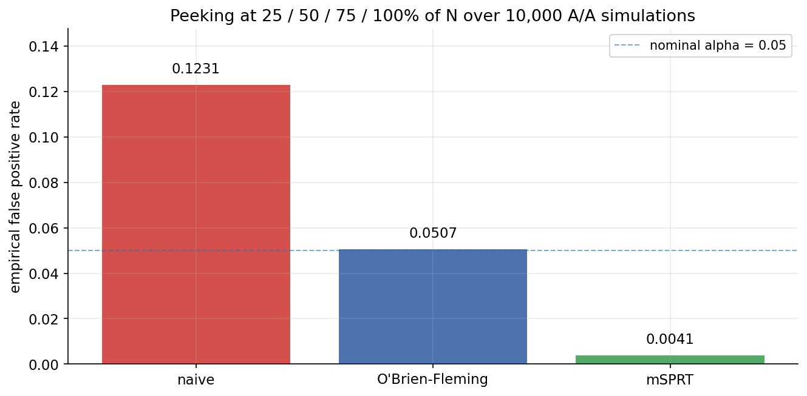
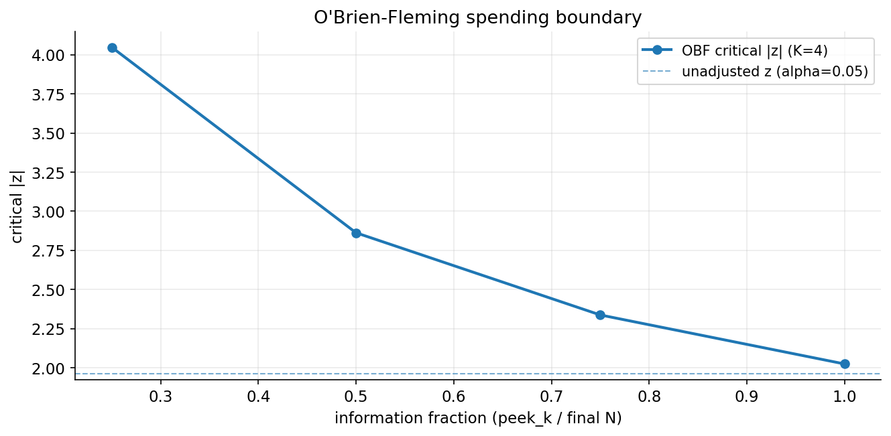
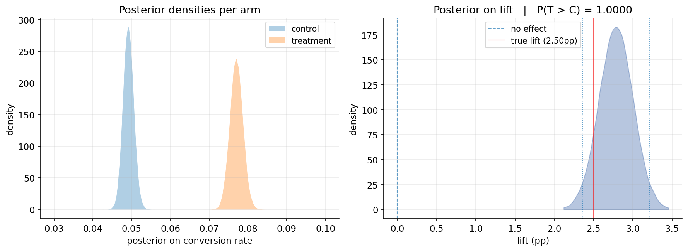

# Peeking at an A/B Test Inflates Your False Positives by 2.5x. I Measured It.

*I built a synthetic experiment with the true effect baked in, then ran ten thousand fake tests to see what happens when you check the results early. Then I checked whether the standard fixes actually work.*

---

Here is a scene that plays out in every product team I have ever seen. An experiment launches on Monday. By Wednesday someone opens the dashboard, sees the treatment is up, and the result is significant, p below 0.05, and asks why we are still waiting. Ship it.

The problem is that the test was designed to run for two weeks, and that Wednesday peek was not free. Every time you look at a running experiment and reserve the right to stop on significance, you give yourself another chance to catch a fluctuation that was never real. The false positive rate you think you are running at, 5 percent, is not the rate you are actually running at.

I wanted to know exactly how much worse it gets. The trouble is you cannot measure that on a real A/B test, because on real data you never know the true answer. If your analysis says treatment won, you have no way to prove it actually did. So I built a synthetic e-commerce funnel where I baked the true effect in myself, recorded it to a file, and then tried to recover it from the outside. When you know the truth, you can finally grade your own work.

## The setup, briefly

The simulation is a six-stage marketplace funnel in the shape of a Noon-style cart flow: impressions, product view, add to cart, checkout start, payment, completion. Fifty thousand users, split into control and treatment. The hypothesis is the kind product teams actually run, a free-shipping-threshold nudge on the cart page, and I injected a true lift of plus 2.5 percentage points on the completion step. That number lives in `ground_truth.json`. Nothing in the analysis code reads it. It exists only so I can check the answer at the end.

The completion baseline sits around 5 percent, so a plus 2.5 point absolute lift is roughly a 50 percent relative improvement. Large, but that is on purpose. The point of this project is not to find a subtle effect. It is to show that the machinery recovers a known effect, calibrates correctly when there is no effect, and survives the things people do to experiments in the wild.

Because everything is synthetic and the truth is written down, every claim below can be re-run. `python scripts/verify_truth.py` regenerates the data across several seeds and checks the answer. That is the whole pitch. On a real experiment you are asking people to trust your analysis. Here I can hand you the proof.

## Finding 1: the analysis recovers the truth

The true lift is plus 2.5 points. A two-proportion z-test on the simulated data recovers plus 2.79 points, with a 95 percent confidence interval of plus 2.36 to plus 3.21 points and a p-value below one in a million.

The interval contains the true value. That sounds obvious, but it is the part you can never confirm on real data. A single run could get lucky, so the `verify_truth.py` gate repeats the whole pipeline across five seeds. The interval covers the true 2.5 points in all five. That five-for-five coverage is the spine of the project. Everything after it is built on a measurement device I have shown to be accurate.

## Finding 2: the boring checks nobody wants to run

Before trusting a single experiment result, you should prove your test would not lie to you when there is nothing to find. This is the A/A test, and it is the most undervalued thing in experimentation.

I drew both arms from the same baseline rate, no effect at all, and ran that 10,000 times. If the statistics are honest, two things should be true. The false positive rate should land near 5 percent, and the p-values should be uniform across zero to one. The empirical rate came back at 0.0505. The histogram is flat.

That 0.0505 is not a throwaway number. If it had drifted to 0.15, then every significant result in the rest of the project would be three times more likely to be noise than I believed. The A/A costs minutes to run. Skipping it costs you a wrong launch decision you will never trace back to its source.

The same idea bites when you slice. I sliced the primary metric by three things, new versus returning, mobile versus desktop, and high versus low order value, which is six tests on one dataset. With a true zero effect, running six uncorrected tests gives you about a 26 percent chance of at least one false win. That is why the notebook reports both Bonferroni and Benjamini-Hochberg corrections side by side, instead of letting you cherry-pick the one segment that happened to clear the bar.

## Finding 3: peeking, and the fixes that actually hold

Now the part I started with. I took the same A/A setup, no real effect, and let the test peek at four interim points, at 25, 50, 75, and 100 percent of the planned sample. The rule was the one people actually use without admitting it: if the result is significant at any look, stop and call it.

The false positive rate climbed from 0.0505 to 0.1231.

So roughly one in eight A/A tests, experiments with no effect whatsoever, would have been declared a winner. That is a 2.5x inflation bought purely by looking early. Nobody changed the data. They just checked it a few times.

Then I tested the two standard corrections, and this is where the project earns its keep, because it is one thing to name a method and another to show it controls the error on your own simulation.

| Method | Empirical false positive rate | Inflation | Controlled |
|---|---|---|---|
| Naive, no correction | 0.1231 | 2.46x | no |
| O'Brien-Fleming bounds | 0.0507 | 1.01x | yes |
| mSPRT, tau 0.025 | 0.0041 | 0.08x | yes |

O'Brien-Fleming spends your alpha unevenly. It demands a much stricter result at the early looks, when the data is thin, and relaxes to the normal threshold by the final one. mSPRT takes a different deal. It is valid no matter how often you look, so you can peek every hour if you want, at the cost of a small power penalty tuned to the effect size you expect.

The operational lesson is not "tell people to stop looking." You will lose that fight every time. It is to run a test that survives being looked at.

## Finding 4: the guardrail that cried wolf

This is my favorite result, because it looks like a bug and is not.

I added three guardrail metrics, the kind you watch to make sure a conversion win is not quietly costing you somewhere else: refund rate per order, cart abandonment, and page-load time. In the simulation, the refund rate is identical for both arms, 4.1 percent, by construction. There is no difference to find.

The guardrail flagged it anyway. Control showed 3.03 percent, treatment showed 4.38 percent, one-sided p of 0.028.

| Guardrail | Control | Treatment | One-sided p | Flagged |
|---|---|---|---|---|
| Refund rate per order | 3.03% | 4.38% | 0.028 | yes |
| Cart abandonment | 6.98% | 6.90% | 0.63 | no |
| Page-load mean, ms | 1849.3 | 1849.5 | 0.41 | no |

Here is what happened. The conversion lift inflated the treatment denominator, so I ended up with about 1,220 control completers against 1,940 treatment completers. Refund rate per order on a few thousand orders is noisy, and across a guardrail suite you will eventually get a 0.028 by chance. This is a false positive, and it is supposed to happen sometimes. The honest move is to say so. A real launch decision would run longer for more completers, or split refunds by reason code, or accept the directional read with the caveat written down. Guardrails are at their most useful exactly when they tell you the data does not yet support a clean call.

## And the Bayesian view, briefly

For the interview question that always comes, "what would a Bayesian say differently," I ran the same data through a Beta-Binomial model with a flat prior. The probability that treatment beats control came out at 1.0000, and the 95 percent credible interval, plus 2.36 to plus 3.21 points, is indistinguishable from the frequentist one at this sample size.

The numbers match. The sentence you get to say does not. A confidence interval is a statement about the procedure: rerun the experiment many times and 95 percent of the intervals you build will contain the truth. A credible interval is a statement about this result: given the data, the lift is in here with 95 percent probability. Stakeholders want the second one, and it pairs cleanly with an expected-loss rule. Here the expected loss of shipping treatment is zero, because the posterior puts no mass on control winning.

## A few honest caveats

The effect is stationary. Real treatment effects often fade or grow in the first week, the novelty and primacy story, and this simulation assumes the lift is constant once a user is randomized.

There are no heterogeneous treatment effects beyond the three simple segments. Everyone gets the same plus 2.5 points, which is why every segment test rejects. A richer version would vary the effect by user type and ask whether the analysis can find that structure.

There is no CUPED variance reduction. It is the obvious next extension and it is out of scope for this version.

And synthetic data inherits the assumptions of whoever wrote the generator, which is me. I model the canonical conditional dropoff between funnel stages and not much more. The honest framing is that synthetic data cannot prove your analysis works on the messiness of production. It can only prove it works when the truth is exactly what you assumed. That is a floor, not a ceiling, but most A/B writeups cannot even clear the floor, because they have no truth to check against.

## Where to dig in

The deployed sample-size calculator, baseline rate, minimum detectable effect, alpha, power, and daily traffic in, required sample size and experiment duration out, is at [the live Streamlit app](https://project-2-ab-testing.streamlit.app).

Code, the six analysis notebooks, the test suite, and the ground-truth file are at [github.com/mmikail07/project-2-ab-testing](https://github.com/mmikail07/project-2-ab-testing). The peeking simulation and the sequential corrections live in [notebooks/05_sequential_peeking.ipynb](https://github.com/mmikail07/project-2-ab-testing/blob/main/notebooks/05_sequential_peeking.ipynb). If you can break the analysis, or you think my guardrail false positive is actually a bug, I would like to hear it.

---

*Mohammad Mikail is a data scientist based in the UAE, building portfolio projects that surface non-obvious findings from data. Reach out on [LinkedIn](https://www.linkedin.com/in/mohammad-mikail-94b3a92a7).*
